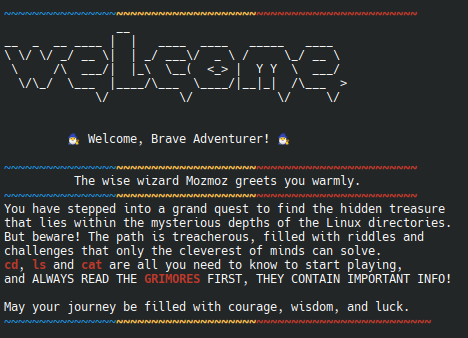

# **Mozmoz bash treasure Game**

## **Table of Contents**
- [Game Overview](#game-overview)
- [Installation](#installation)
- [How to Play](#how-to-play)

## **Game Overview**
**Mozmoz quest** is an interactive Bash-based adventure game where players search for a treasure within the directories. Through the journey, you'll encounter several challenges, but don't you worry you'll be guided ^^.

This game is a fun way to learn about the Linux system. It's a command-line (cmd) game where you enter a dungeon of directories with the help of Mozmoz, a friendly wizard.

## **Installation**

There are two ways to install and play the game:

### Option 1: Clone from GitHub
1. **Clone the repository:**
   ```bash
    git clone https://github.com/tayssirgh/mozmoz-treasure.git
    cd mozmoz-treasure.
2. **Run the game:**
   ```bash
    chmod +x ./.welcome.sh
   ./.welcome.sh
### Option 2: Pull from Docker Hub
1. **Pull the Docker image:**
   ```bash
    docker pull tayssirgh/mozmoz-treasure
2. **Run the container:**
   ```bash
    docker run -it tayssirgh/mozmoz-treasure
## **How to play**
Before starting your adventure, it is recommended to be familiar with the basic Linux commands: `cat`, `ls`, and `cd`. These will be essential for navigating the game's world.

Once the game starts, follow the instructions given by Mozmoz, the friendly wizard, who will guide you through the dungeon of directories. Along the way, you'll face challenges where Grimoires  will provide hints and guidance. Be sure to read them carefully, as they hold the secrets to advancing.


Have fun playing 🥰!




